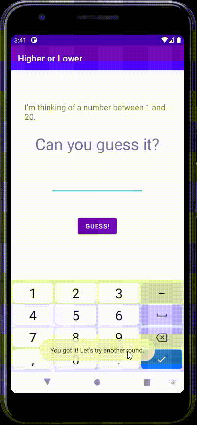

# Higher or Lower

This is a simple game where a user arrives at the correct number  
after guessing. The only hint being provided to the user is  
whether their guessed number is higher or lower than the correct  
number.  

 
